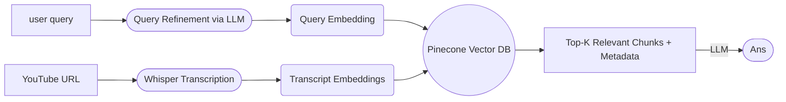

# YouTube RAG Chatbot


## 📌 Project Overview

**YouTube Transcript RAG** is an end-to-end **Retrieval-Augmented Generation (RAG)** system that converts YouTube videos into a **searchable knowledge base**.  
It enables users to ask natural language questions about video content and receive **accurate, cited answers** with direct links to the relevant timestamps.

The system is built using:

-   **FastAPI** for the backend    
-   **HTML, CSS, and JavaScript** for the frontend   
-   **OpenAI Whisper, LangChain, and Pinecone** for transcription, retrieval, and reasoning

## ✨ Features

-   **Parallel Transcription**
    -   High-speed audio transcription using **multi-threaded OpenAI Whisper API calls**    
-   **Robust RAG Pipeline**
    -   Semantic retrieval using **LangChain + Pinecone**
    -   Accurate reasoning with **GPT-4o / GPT-4o-mini**
-   **Scalable Architecture**
    -   Modular ingestion, retrieval, and generation layers
    -   Designed for production-ready extension
-   **System Governance**
    -   Dedicated FastAPI endpoints for:
        -   Resource cleanup
        -   Index management
        -   Health monitoring

## 🛠️Technologies stack

**Backend & Orchestration**
-   **FastAPI** – REST API framework
-   **LangChain** – RAG orchestration

**Audio & Transcription**
-   **yt-dlp** – YouTube audio extraction
-   **FFmpeg** – Audio preprocessing   
-   **OpenAI Whisper** – Speech-to-text

**Embeddings & Retrieval**
-   **Embeddings:** `text-embedding-ada-002`   
-   **Vector Database:** Pinecone

**Reasoning**
-   **LLMs:** GPT-4o / GPT-4o-mini

**Frontend**
-   **HTML, CSS, JavaScript**

# YouTube Transcript RAG flow chart:


## 🧠 RAG Architecture Overview
A Retrieval-Augmented Generation (RAG) system bridges **static knowledge** (video transcripts) with **dynamic reasoning** (LLMs).  
This project follows a **three-phase pipeline**.

## 1️⃣ Ingestion – Data Preparation Phase

This phase converts raw video data into a structured, searchable format.

### Steps:
-   **Audio Extraction**
   --   Downloads YouTube audio using `yt-dlp`
   --   Converts audio to `.wav` format using FFmpeg
-   **Chunked Transcription**
 --   Audio is split into smaller chunks (e.g., 180 seconds)
 --   Chunks are transcribed **in parallel** using OpenAI Whisper
-   **Text Chunking**
--   Uses `RecursiveCharacterTextSplitter`
--  Chunk size: **1000 characters**
--  Overlap: **200 characters** to preserve context
-   **Embedding Generation**
 --   Each chunk is converted into a vector using `OpenAI embedding model-text-embedding-3-small`
-   **Vector Storage**
 --  Vectors are stored in **Pinecone**, along with:
  --   Timestamps
 --   YouTube URLs            
----------
## 2️⃣ Retrieval – Semantic Search Phase
Triggered when a user submits a query.

### Steps:
-   **Query Embedding**
 --   User question is converted into an embedding vector
-   **Similarity Search**
--   Pinecone computes **cosine similarity**
--   Identifies transcript chunks most relevant to the query
-   **Top-K Selection**
--   Retrieves the best **3–5 chunks**
-   **Metadata Extraction**
--   Fetches timestamps and YouTube URLs for citation
----------
## 3️⃣ Generation – Answer Synthesis Phase

This phase transforms retrieved facts into a coherent answer.

### Steps:
-   **Prompt Augmentation**
--   Combines:
--   User query
 --   Retrieved transcript chunks
-   **Prompt Guardrails**
--   The LLM is instructed to:
 --   Use only provided context
 --   Avoid hallucination
--   Cite sources
-   **LLM Reasoning**
--   GPT-4o / GPT-4o-mini generates the final answer
-   **Final Output**
--   Clear explanation
--   Timestamped YouTube references

## 📂 Project Structure

```movie-recommender-app-project/
youtube-chatbot-rag/
│
├── config.py                  # Environment & configuration
├── ingestion_services.py      # Audio download & transcription
├── rag.py                     # RAG pipeline logic
├── main_api.py                # FastAPI application entry point
├── requirements.txt           # Dependencies
├── README.md                  # Documentation
└── .gitignore
```
## 🚀 Getting Started

### Prerequisites

List any software or dependencies a user needs to have installed.

   * Python 3.9+
   * pip
   * Git
   * FFmpeg installed on your system path
   * OpenAI & Pinecone API Keys
   
## 📦 Installation

1.  Clone the repository:
    ```bash
    git clone https://github.com/InfinityJais/youtube-chatbot-rag.git
    ```
2.  Navigate to the project directory:
    ```bash
    cd youtube-chatbot-rag
    ```
3.  Create vertual envirment:
    ```bash
    python -m venv venv
    ```
4.  Activate vertual enveirement:
    ```bash
    venv\Scripts\activate  #Windows
    ```
    ```bash
    source venv/bin/activate  #Mac/Linux
    ```
5.  Install the required libraries:
    ```bash
    pip install -r requirements.txt
    ```
5.  Run FastAPI server:
    ```bash
    uvicorn main_api:app --reload 
    ```
---
## 🎯 Usage

1. Open Fastapi docs in browser → http://localhost:3000
2. Submit a YouTube video URL
3. Ask questions about the video and Receive answers
4. Connect frontend (HTML/JS) with backend API
5. Enjoy your personalized YouTube Transcript RAG 🎉

## 🧭 Project Roadmap & Versioning

### 🔹 Version 1 (Current)

**YouTube Transcript RAG v1** focuses on building a **robust, production-ready RAG pipeline** with the following capabilities:
-   End-to-end YouTube audio ingestion and transcription (Whisper)
-   Chunking, embedding, and vector storage (Pinecone)
-   Semantic retrieval using cosine similarity
-   LLM-based answer generation with citations and timestamps
-   FastAPI backend with modular services
-   HTML/CSS/JS frontend integration
    
This version establishes a **strong foundation** for accurate, citation-aware question answering over video content.

----------
### 🔹 Version 2 (Planned Enhancements)

**YouTube Transcript RAG v2** will extend the system into an **agentic, observable, and memory-aware architecture**, including:

-   **Observability**
--   Structured logging, metrics, and tracing
--   Monitoring of LLM calls, latency, token usage, and errors
--   System health and ingestion pipeline monitoring
        
-   **Memory Layer**
--   Short-term memory for conversational context
--   Long-term memory for user preferences and historical queries
--   Vector-based memory for semantic recall
        
-   **Multi-Agent RAG**
--   Specialized agents (Retriever Agent, Reasoning Agent, Citation Agent)
--   Agent collaboration and task orchestration
--   Improved reasoning, grounding, and answer reliability
        
-   **Scalability & Governance**
--   Better resource management
--   Safer prompt guardrails
--   Human-in-the-loop extensions
        
----------
### 🚀 Vision
The long-term goal is to evolve this project from a **single-agent RAG system** into a **production-grade, multi-agent knowledge intelligence platform** for video understanding.

## 🤝 Contributing

1.  Fork the repository.
2.  Create your feature branch (`git checkout -b feature/YourFeature`).
3.  Commit your changes (`git commit -m 'Add yourFeature'`).
4.  Push to the branch (`git push origin feature/yourFeature`).
5.  Open a Pull Request.

---

## 📜 License
This project is licensed under the MIT License - see the `LICENSE` file for details.
